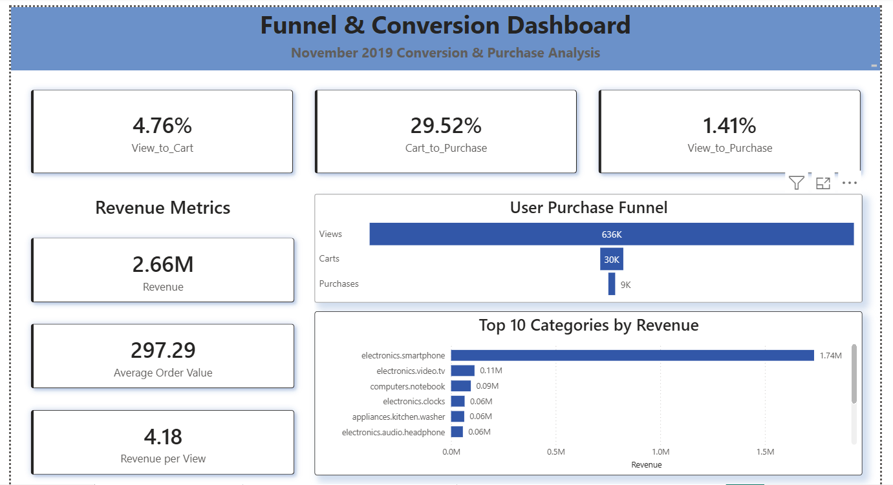
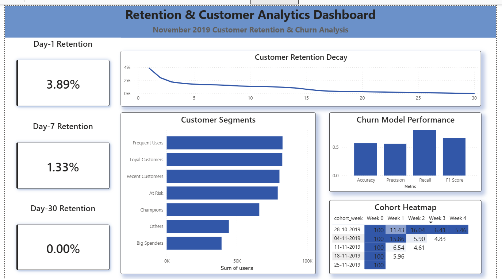
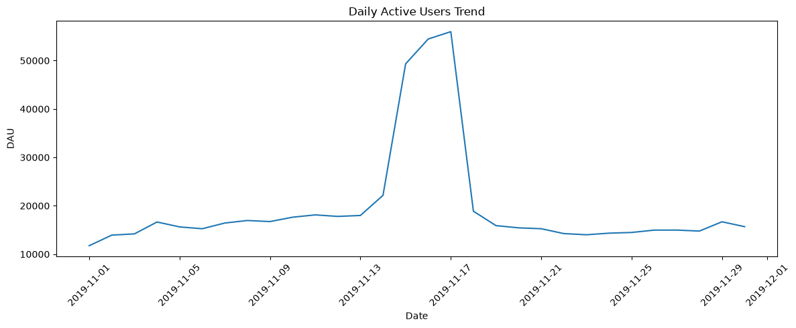
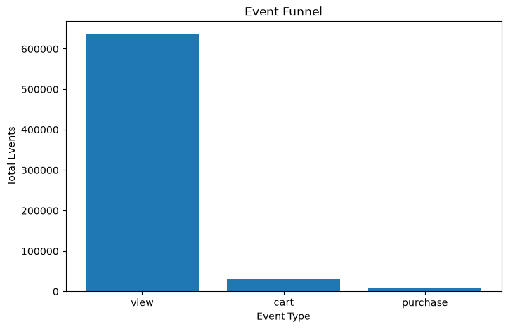
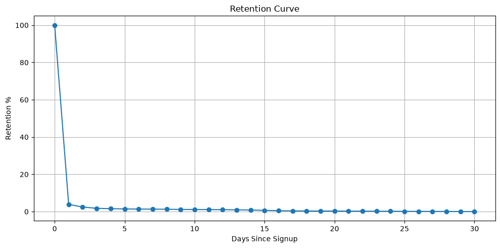
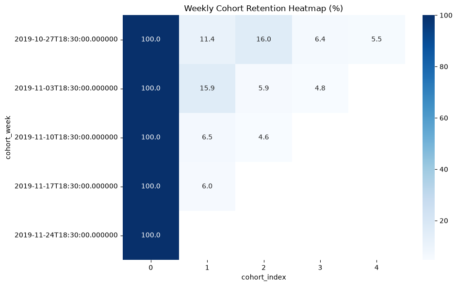
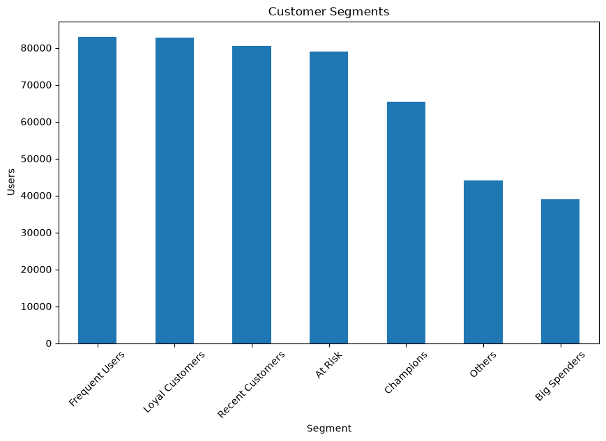

# Product Analytics & User Retention Platform

An end-to-end Product Analytics project built using PostgreSQL, Python, Machine Learning, and Power BI.

The project analyzes customer behavior across the entire customer lifecycle, including:

- Product Metrics
- Funnel Analysis
- Retention Analysis
- Cohort Analysis
- Customer Segmentation
- A/B Testing
- Churn Prediction
- Executive Dashboards

The objective is to simulate how modern product analytics teams monitor user engagement, identify retention problems, understand customer segments, and predict churn.

---

# Project Architecture

```text
Raw Ecommerce Dataset
        │
        ▼
Data Validation & Cleaning
        │
        ▼
Sampling & Processing
        │
        ▼
PostgreSQL Database
        │
        ▼
SQL Analytics Layer
        │
 ┌──────┼──────┐
 ▼      ▼      ▼
Funnel  Retention Cohort
Analysis Analysis Analysis
 │
 ▼
Customer Segmentation
 │
 ▼
A/B Testing
 │
 ▼
Churn Prediction
 │
 ▼
Power BI Dashboards
```

---

# Dataset

This project uses the Ecommerce Behavior Dataset from a multi-category online store.

### Dataset Details

| Metric | Value |
|----------|----------|
| Original Dataset Size | ~9 GB |
| Sample Used | ~675,000 Events |
| Event Types | View, Cart, Purchase |
| Users | 473,566 |
| Source | Kaggle Ecommerce Behavior Dataset |

### Important Note

Due to GitHub storage limitations, the raw dataset is not included in this repository.

To reproduce the project:

1. Download the Ecommerce Behavior Dataset from Kaggle
2. Place the dataset inside:

```text
data/raw/
```

3. Execute notebooks in sequence.

---

# Technology Stack

## Data Engineering

- PostgreSQL
- SQL
- Python

## Data Analysis

- Pandas
- NumPy

## Machine Learning

- Scikit-Learn
- Random Forest Classifier

## Visualization

- Matplotlib
- Seaborn
- Power BI

---

# Repository Structure

```text
ProductAnalyticsPlatform/

├── notebooks/
│   ├── 01_data_validation.ipynb
│   ├── 02_sampling.ipynb
│   ├── 03_eda.ipynb
│   ├── 04_load_to_postgres.ipynb
│   ├── 05_product_metrics.ipynb
│   ├── 06_funnel_analysis.ipynb
│   ├── 07_retention_analysis.ipynb
│   ├── 08_cohort_analysis.ipynb
│   ├── 09_user_segmentation.ipynb
│   ├── 10_ab_testing.ipynb
│   └── 11_churn_prediction.ipynb
│
├── sql/
│   ├── dau.sql
│   ├── wau.sql
│   ├── mau.sql
│   ├── funnel_analysis.sql
│   ├── retention_analysis.sql
│   ├── cohort_analysis.sql
│   ├── segmentation.sql
│   └── churn_features.sql
│
├── outputs/
│
├── powerbi/
│   ├── dashboards/
│   └── datasets/
│
├── docs/
│
└── README.md
```

---

# Product Metrics

The platform calculates key engagement metrics:

- Daily Active Users (DAU)
- Weekly Active Users (WAU)
- Monthly Active Users (MAU)
- Stickiness Ratio
- Revenue Metrics

### Key Results

| Metric | Value |
|----------|----------|
| MAU | 473,566 |
| Average DAU | 19,106 |
| Stickiness | ~4% |

---

# Funnel Analysis

Customer journey analyzed:

```text
View → Cart → Purchase
```

### Funnel Performance

| Stage | Conversion |
|----------|----------|
| View → Cart | 4.76% |
| Cart → Purchase | 29.52% |
| View → Purchase | 1.41% |

---

# Retention Analysis

User retention was measured across multiple time windows.

### Key Findings

| Metric | Value |
|----------|----------|
| Day-1 Retention | 3.89% |
| Day-7 Retention | 1.33% |
| Day-30 Retention | ~0% |

Retention drops significantly after the first interaction, indicating opportunities for user re-engagement campaigns.

---

# Cohort Analysis

Weekly cohorts were created to understand user retention behavior over time.

The cohort matrix highlights how user engagement decays after acquisition and helps identify high-performing customer acquisition periods.

---

# Customer Segmentation

Customers were segmented using behavioral metrics:

- Frequent Users
- Loyal Customers
- Recent Customers
- Champions
- At Risk
- Big Spenders

Segmentation helps marketing teams personalize retention and acquisition strategies.

---

# A/B Testing

A/B testing was performed to evaluate statistical differences between user groups.

### Techniques Used

- Hypothesis Testing
- Statistical Significance Testing
- Conversion Comparison

---

# Churn Prediction

Machine learning was used to predict customer churn.

### Features Used

- User Activity
- Revenue
- Purchase Behavior
- Engagement Metrics

### Model Performance

| Metric | Score |
|----------|----------|
| Accuracy | 56.62% |
| Precision | 56% |
| Recall | 80% |
| F1 Score | 66% |

---

# Power BI Dashboards

## Executive Dashboard


---

## Funnel Dashboard



---

## Retention Dashboard



---

# Key Visualizations

## Daily Active Users Trend



---

## Event Funnel



---

## Retention Curve



---

## Cohort Heatmap



---

## Customer Segments



---

## Churn Feature Importance


---

# Business Insights

### User Engagement

- MAU reached 473K+ users.
- Average DAU remained around 19K users.
- Stickiness remained approximately 4%.

### Conversion Funnel

- Only 4.76% of viewers added products to cart.
- 29.52% of cart users completed purchases.
- Overall purchase conversion was 1.41%.

### Retention

- Retention decays rapidly after first use.
- Day-30 retention approaches zero.

### Churn

- Recall of 80% allows the model to identify most churn-risk customers.
- Revenue and engagement metrics were among the strongest predictors.

---

# Skills Demonstrated

- Product Analytics
- SQL
- PostgreSQL
- Python
- Pandas
- NumPy
- Data Cleaning
- Exploratory Data Analysis
- Funnel Analysis
- Retention Analytics
- Cohort Analysis
- Customer Segmentation
- A/B Testing
- Machine Learning
- Churn Prediction
- Data Visualization
- Power BI

---

# Author

**Ananya Upadhyay**

M.Tech CSE, LNMIIT Jaipur

Interested in:

- Data Science
- Data Analytics
- Product Analytics
- Business Analytics
- Machine Learning
- AI/ML Research
